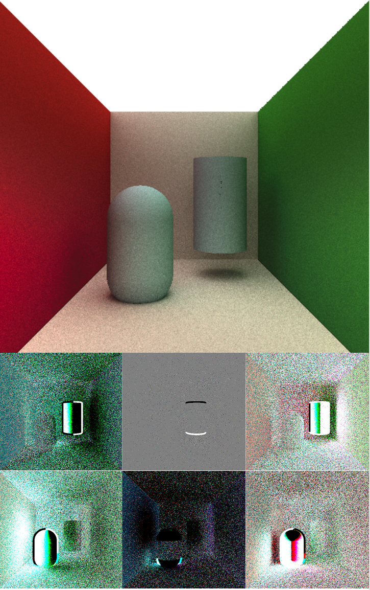

# Intro

Jiayi Li, Ethan Williams, Eric Chen (Team SDF: Sensational Derivative Fun) worked on this project. We had a final project presentation [with slides](https://docs.google.com/presentation/d/1ccIIOmtE-_Sr1BH-Tv8BTCCOI29Wx_p-VSmyhHoaVdA/edit?usp=sharing).

We mostly implemented [A Simple Approach to Differentiable Rendering of SDFs](https://dl.acm.org/doi/full/10.1145/3680528.3687573), by Zichen Wang, Xi Deng, Ziyi Zhang, Wenzel Jakob, and Steve Marschner.



# How to build and run

To produce single-frame gradient and rendering results for debugging, run

```sh
./make.sh run-debug
```

This creates the following directories:
- debug-phong: contains the phong gradients and final phong rendering
- debug-tracing: contains the path traced gradients and final path traced rendering
- debug-fd: contains the phong gradients obtained with finite difference method
- debug-effects: experimental results for chromatic abberation and edge detection filter gradients

To run gradient descent, make sure there is an image called "groundtruth.ppm" in the root directory and run

```sh
./make.sh run-descent
```

This creates the following:
- descent-sequence: directory containing one .ppm frame for each epoch of gradient descent
- descent-sequence.mp4: video combining all gradient descent frames together

# Code structure

The entry point of the run-debug command is debug.cpp, while the entry point of the run-descent command is descent.cpp. hello.cpp contains the rest of the functions which are utilized by these entry points. Here are links to a few key places in the code:
- TODO

# References

This project uses [Enzyme](https://enzyme.mit.edu/) and [linmath.h](https://github.com/datenwolf/linmath.h).

Our dependency linmath.h is a simple header-only linear algebra library that defines types like `vec3`, `vec4`, and `mat4x4`.

Enzyme is a tool that autodiffs existing C code. The two most helpful pages in the reference are:

* <https://enzyme.mit.edu/getting_started/CallingConvention/>
* <https://enzyme.mit.edu/getting_started/Examples/>

Since we will be working with SDFs, Inigo Quilezles blog will be very helpful. There is a [page](https://iquilezles.org/articles/distfunctions/) that specifies SDFs for many 3d shapes, along with the operations needed to compose them to form more complex scenes.

I have also referenced Chris Wellons blog <https://nullprogram.com> in some places where we have used his subroutines.
